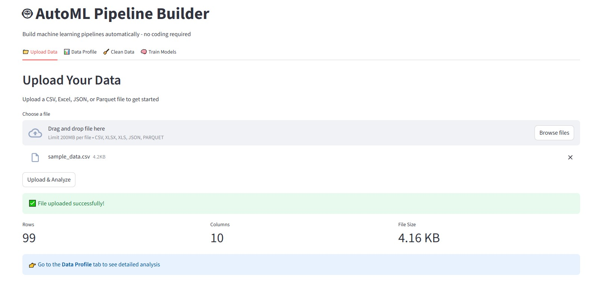
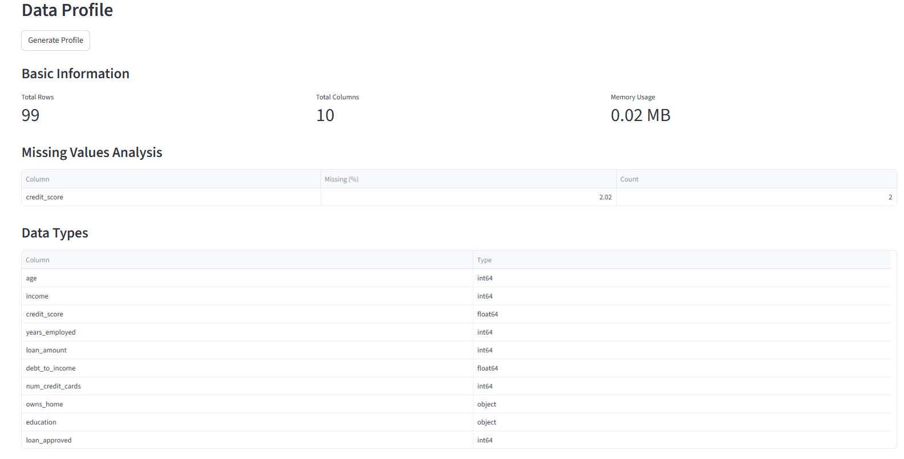
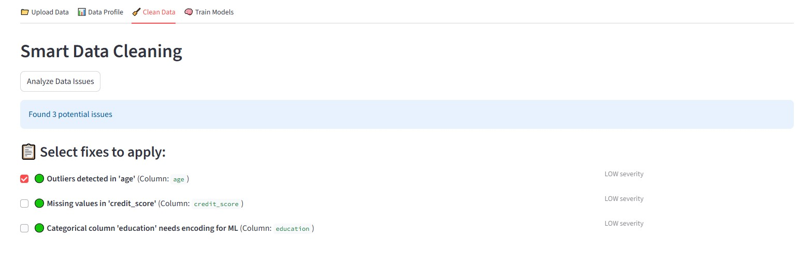
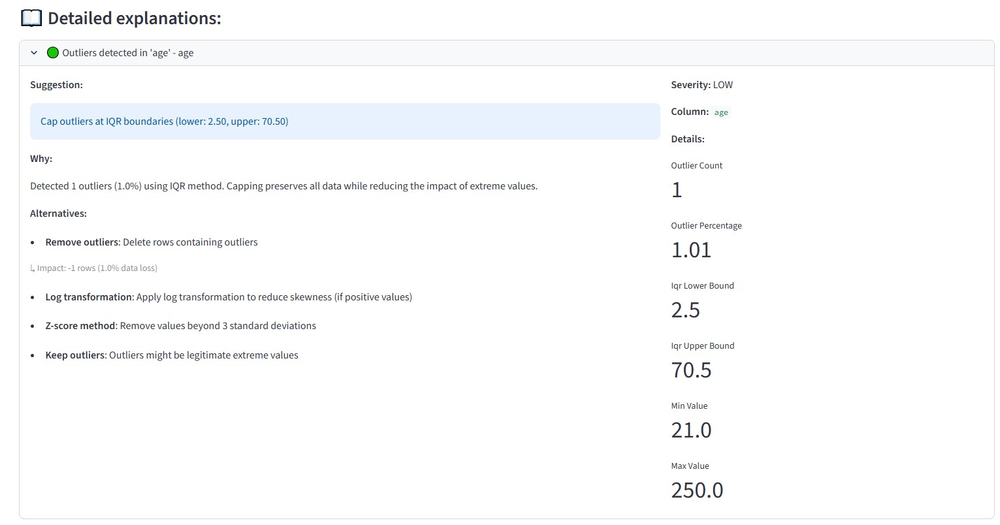
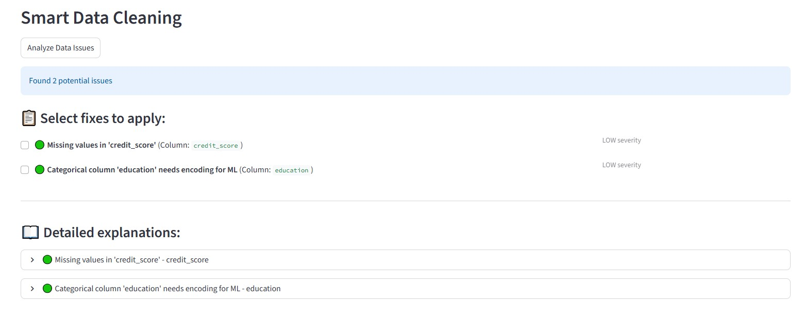
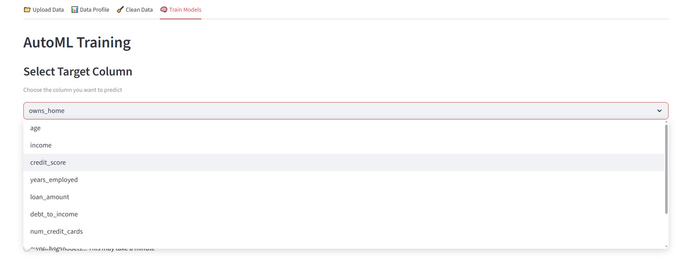
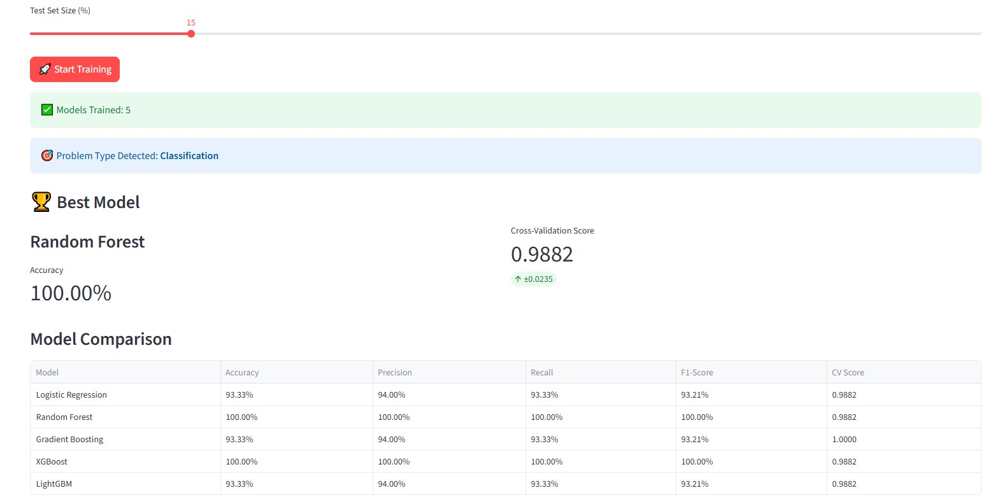
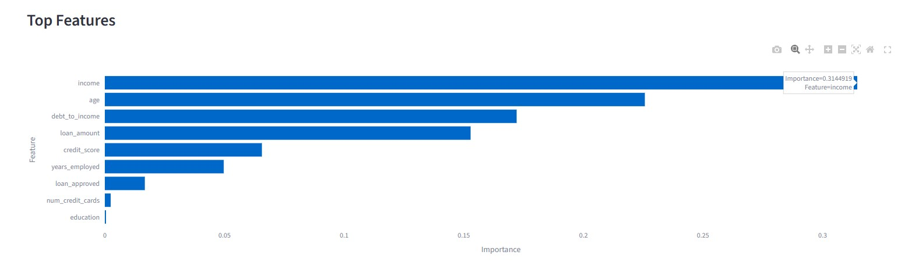

# 🤖 AutoML Pipeline Builder

> **From Raw Data to Production Models in Minutes - Zero Code Required**

[](https://www.python.org/downloads/)
[](https://fastapi.tiangolo.com/)
[](https://streamlit.io/)
[](https://pytorch.org/)
[](https://mlflow.org/)
[](https://shap.readthedocs.io/)
[](LICENSE)

An **explainability-first AutoML platform** for both **Tabular ML** and **Computer Vision**. Upload your data, train state-of-the-art models automatically, and get production-ready predictions with interpretability. Built with FastAPI, Streamlit, PyTorch, and featuring MLflow experiment tracking.

---

## 🎯 What is This?

AutoML Pipeline Builder is a complete machine learning automation platform that supports both **Tabular ML** and **Computer Vision**. Upload your data (CSV or images), get smart cleaning suggestions, train multiple state-of-the-art models automatically, and make production-ready predictions with interpretability.

**Key Highlights:**

### 📊 Tabular ML
- ✅ Automatic problem detection (classification vs regression)
- ✅ Smart data cleaning with explainability
- ✅ Train 6 models: Linear/Ridge, Random Forest, Gradient Boosting, XGBoost, LightGBM
- ✅ SHAP values for model interpretability
- ✅ Bilingual interface (EN/DE)

### 📸 Computer Vision (NEW!)
- ✅ **Vision Transformers (ViT)** - State-of-the-art from Google
- ✅ **4 Model Comparison**: MobileNetV3, ResNet18, EfficientNet-B0, ViT-Base
- ✅ **Transfer Learning** from ImageNet (1.2M images)
- ✅ **Grad-CAM Visualization** - See what the model focuses on
- ✅ **Confusion Matrix** - Per-class performance metrics
- ✅ **Real-time Predictions** - Upload image → get predictions
- ✅ **Model Export** - Download trained models (.pth)

### 🔧 Production Features
- ✅ MLflow experiment tracking
- ✅ REST API with OpenAPI docs
- ✅ Model versioning & download
- ✅ Automated testing

---

## ✨ Features

## 📊 Tabular ML Pipeline

### 📤 Data Upload
Upload CSV, Excel, JSON, or Parquet files with automatic format detection.



### 📊 Data Profiling
Comprehensive automatic analysis with statistics, correlations, distributions, and missing value detection.



### 🧹 Smart Data Cleaning
Explainability-first cleaning suggestions. Every recommendation comes with reasoning, alternatives, and impact analysis.





### 🤖 AutoML Training
Automatic model selection and training with 5-fold cross-validation. Compare 6 different models side-by-side.





### 🔬 MLflow Integration
Track every experiment with parameters, metrics, and model artifacts for full reproducibility.

### 🎓 SHAP Explainability
Understand why your models make predictions with SHAP (SHapley Additive exPlanations) values.

---

## 📸 Computer Vision Pipeline

### 🤖 4 State-of-the-Art Models
Train and compare 4 modern architectures automatically:
- **MobileNetV3**: Super fast, mobile-optimized (~1-2 min)
- **ResNet18**: Lightweight CNN, fast training (~1-2 min)
- **EfficientNet-B0**: Balanced speed/accuracy (~2-3 min)
- **ViT-Base**: Vision Transformer from Google, state-of-the-art (~5-8 min)

**Total training time: ~10-12 minutes** on slow PC (fast models finish first!)

### 📤 Upload Image Datasets
Simple ZIP upload with folder-per-class structure:
```
dataset.zip
  /class1
    image1.jpg
    image2.jpg
  /class2
    image1.jpg
    image2.jpg
```

Supports: JPG, PNG, BMP, TIFF, WEBP | Handles grayscale and RGB | Smart nested structure detection

### 🔮 Real-time Predictions
Upload any image → get instant predictions with:
- **Top 3 classes** with confidence scores
- **Grad-CAM heatmaps** showing what the model focuses on (interpretability!)
- Model accuracy from training

### 📊 Advanced Metrics
- **Confusion Matrix** - See which classes are confused
- **Per-class Precision/Recall/F1** - Detailed performance breakdown
- **MLflow Tracking** - Every experiment logged automatically

### 💾 Model Export
Download trained models (.pth format) for production deployment

### 🎯 Transfer Learning
All models use pre-trained ImageNet weights (1.2M images, 1000 classes):
- ✅ Better accuracy with less data
- ✅ Faster training (minutes vs days)
- ✅ Production-ready performance

**See full CV guide:** [CV_QUICKSTART.md](CV_QUICKSTART.md)

---

## 🚀 Quick Start

### Prerequisites
- Python 3.9 or higher
- Virtual environment (recommended)

### Installation

1. **Clone the repository**
```bash
git clone https://github.com/kitsakisGk/AutoML-Forge.git
cd AutoML-Forge
```

2. **Create and activate virtual environment**
```bash
# Windows
python -m venv venv
venv\Scripts\activate

# Linux/Mac
python3 -m venv venv
source venv/bin/activate
```

3. **Install dependencies**
```bash
pip install -r requirements/base.txt
```

### Running the Application

**Option 1: Run both backend and frontend separately**

Terminal 1 - Backend:
```bash
python run_backend.py
```

Terminal 2 - Frontend:
```bash
streamlit run frontend/app.py
```

**Option 2: Run everything together**
```bash
python start_all.py
```

Then open:
- **Application UI**: http://localhost:8501
- **API Documentation**: http://localhost:8000/api/docs

---

## 📖 How to Use

### 1. Upload Your Data
Upload CSV, Excel, JSON, or Parquet files (up to 2GB). The platform automatically detects file format and encoding.

### 2. Explore Data Profile
Get automatic insights including:
- Summary statistics (mean, median, std, min, max)
- Missing values analysis
- Feature correlations
- Distribution visualizations
- Data type detection

### 3. Clean Your Data
Receive smart cleaning suggestions with full explanations:
- **Missing values**: Imputation strategies with reasoning (median for outliers, mean for normal distributions)
- **Outliers**: IQR-based detection with impact analysis
- **Data types**: Automatic type correction recommendations
- **Alternatives**: Multiple approaches for every issue

Each suggestion explains:
- ✅ What the issue is
- ✅ Why the fix is recommended
- ✅ What alternatives exist
- ✅ What the impact will be

### 4. Train Models
Automatically train and compare 6 different models:

**Classification:**
- Logistic Regression
- Random Forest
- Gradient Boosting
- XGBoost
- LightGBM

**Regression:**
- Linear Regression
- Ridge Regression
- Random Forest
- Gradient Boosting
- XGBoost
- LightGBM

**Features:**
- Automatic problem type detection
- 5-fold cross-validation for robust evaluation
- Feature importance analysis
- Model comparison dashboard
- Best model selection based on primary metric (accuracy/R²)

### 5. View Experiment Tracking

Track all ML experiments with MLflow:

```bash
# Terminal viewer (always works)
python view_mlflow_results.py

# MLflow web UI (may show blank page on Windows)
python run_mlflow.py
```

View:
- All model runs with parameters and metrics
- Cross-validation scores
- Feature importance artifacts
- Model artifacts for deployment

---

## 🛠️ Tech Stack

**Backend:**
- FastAPI - Modern async Python web framework
- Pydantic - Data validation and settings
- scikit-learn - Traditional ML algorithms
- XGBoost/LightGBM - Gradient boosting frameworks
- SHAP - Model explainability
- MLflow - Experiment tracking and model versioning

**Frontend:**
- Streamlit - Interactive web UI
- Plotly - Interactive visualizations
- i18n support - English/German translations

**Data Processing:**
- Pandas/NumPy - Data manipulation
- ydata-profiling - Automated profiling

**DevOps:**
- Docker - Containerization
- pytest - Testing framework
- GitHub Actions - CI/CD pipeline

---

## 🌍 Bilingual Support

Fully bilingual interface supporting:
- 🇬🇧 **English**
- 🇩🇪 **German** (Swiss market focus)

Translation files: `frontend/i18n/en.json` and `frontend/i18n/de.json`

---

## 🧪 Testing

Run the test suite:

```bash
# Run all tests
pytest tests/ -v

# Run with coverage
pytest tests/ -v --cov=backend --cov-report=html
```

Tests are automatically run on GitHub Actions for Python 3.9, 3.10, and 3.11.

---

## 📄 License

This project is licensed under the MIT License - see the [LICENSE](LICENSE) file for details.

---

## 👤 Author

**Kitsakis Giorgos**

- LinkedIn: [https://www.linkedin.com/in/georgios-kitsakis-gr/](https://www.linkedin.com/in/georgios-kitsakis-gr/)
- GitHub: [https://github.com/kitsakisGk](https://github.com/kitsakisGk)
- Email: kitsakisgk@gmail.com

---

## 🙏 Acknowledgments

- Inspired by modern AutoML tools (H2O.ai, AutoGluon, PyCaret)
- Focus on explainability and production-readiness
- Built with attention to code quality and best practices
