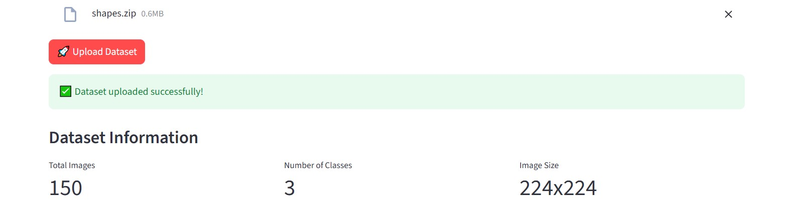
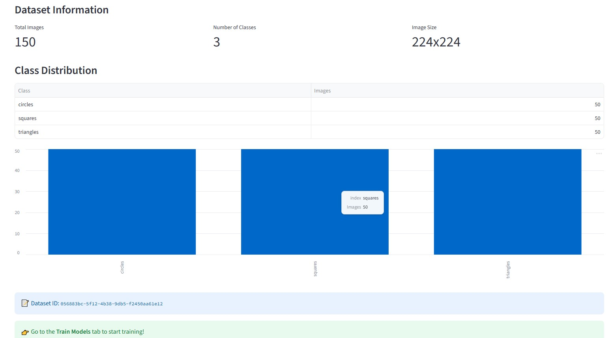
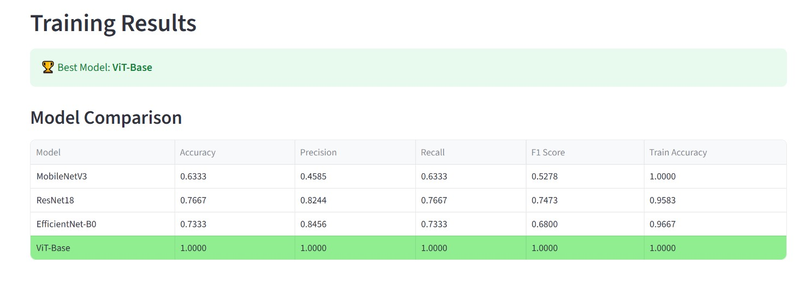
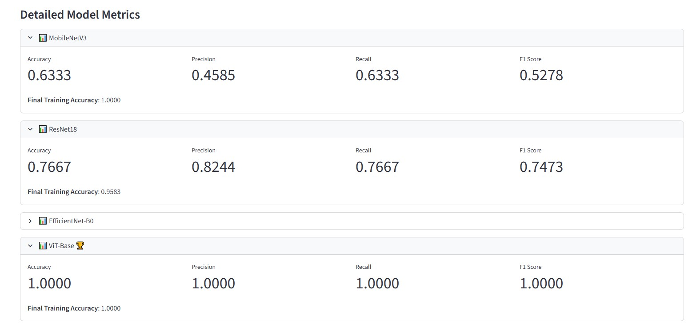
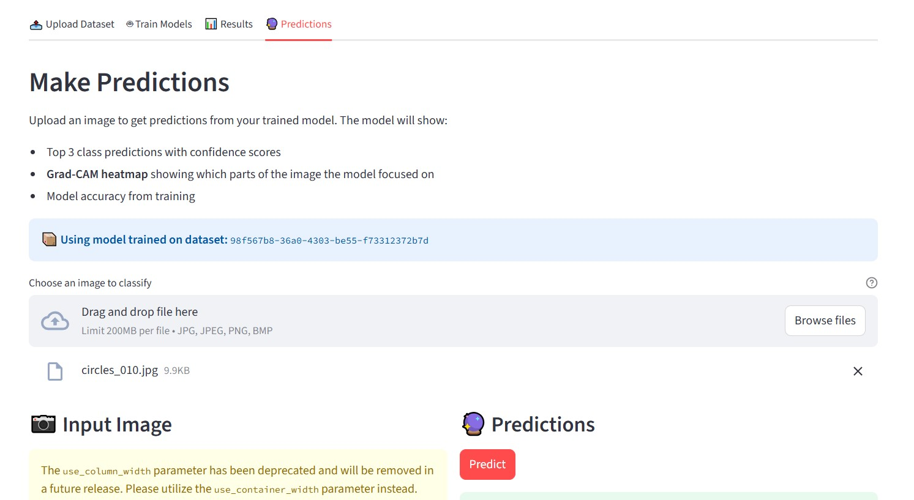
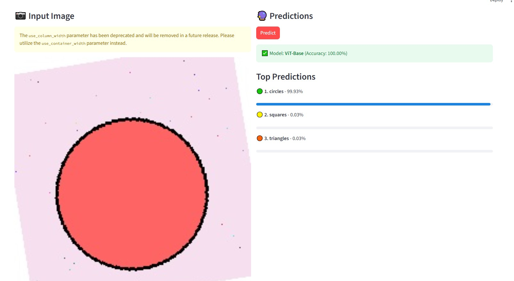
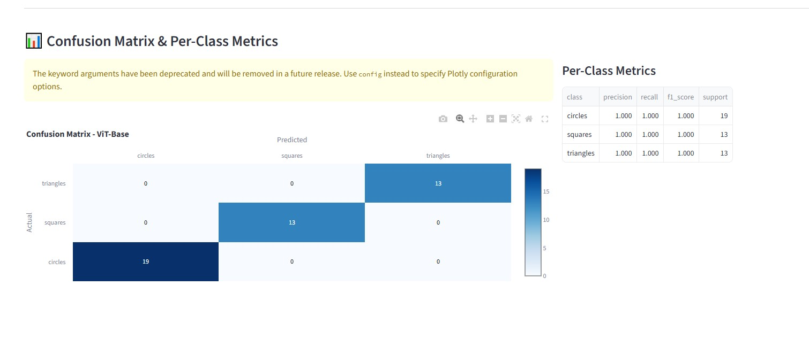
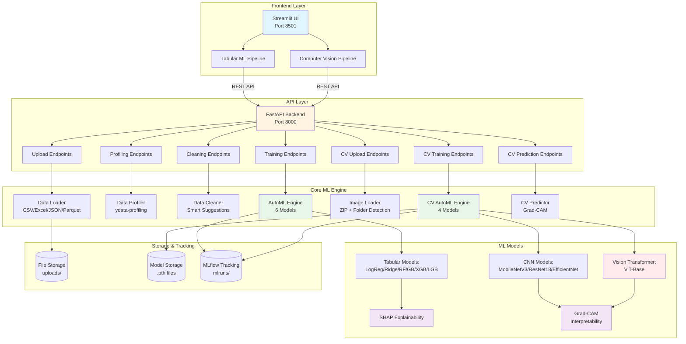

# 🤖 AutoML Pipeline Builder

> **From Raw Data to Production Models in Minutes - Zero Code Required**

[](https://www.python.org/downloads/)
[](https://fastapi.tiangolo.com/)
[](https://streamlit.io/)
[](https://pytorch.org/)
[](https://mlflow.org/)
[](https://shap.readthedocs.io/)
[](LICENSE)

**🎯 [Try Live Demo on HuggingFace Spaces](https://huggingface.co/spaces/kitsakisG/automl-forge)** 🚀

An **explainability-first AutoML platform** for both **Tabular ML** and **Computer Vision**. Upload your data, train state-of-the-art models automatically, and get production-ready predictions with interpretability. Built with FastAPI, Streamlit, PyTorch, and featuring MLflow experiment tracking.

---

## 🎯 What is This?

AutoML Pipeline Builder is a complete machine learning automation platform that supports both **Tabular ML** and **Computer Vision**. Upload your data (CSV or images), get smart cleaning suggestions, train multiple state-of-the-art models automatically, and make production-ready predictions with interpretability.

**Key Highlights:**

### 📊 Tabular ML
- ✅ Automatic problem detection (classification vs regression)
- ✅ Smart data cleaning with explainability
- ✅ Train 6 models: Linear/Ridge, Random Forest, Gradient Boosting, XGBoost, LightGBM
- ✅ SHAP values for model interpretability
- ✅ Bilingual interface (EN/DE)

### 📸 Computer Vision (NEW!)
- ✅ **Vision Transformers (ViT)** - State-of-the-art from Google
- ✅ **4 Model Comparison**: MobileNetV3, ResNet18, EfficientNet-B0, ViT-Base
- ✅ **Transfer Learning** from ImageNet (1.2M images)
- ✅ **Grad-CAM Visualization** - See what the model focuses on
- ✅ **Confusion Matrix** - Per-class performance metrics
- ✅ **Real-time Predictions** - Upload image → get predictions
- ✅ **Model Export** - Download trained models (.pth)

### 🔧 Production Features
- ✅ MLflow experiment tracking
- ✅ REST API with OpenAPI docs
- ✅ Model versioning & download
- ✅ Automated testing

---

## ✨ Features

## 📊 Tabular ML Pipeline

### 📤 Data Upload
Upload CSV, Excel, JSON, or Parquet files with automatic format detection.


### 📊 Data Profiling
Comprehensive automatic analysis with statistics, correlations, distributions, and missing value detection.


### 🧹 Smart Data Cleaning
Explainability-first cleaning suggestions. Every recommendation comes with reasoning, alternatives, and impact analysis.


### 🤖 AutoML Training
Automatic model selection and training with 5-fold cross-validation. Compare 6 different models side-by-side.


### 🔬 MLflow Integration
Track every experiment with parameters, metrics, and model artifacts for full reproducibility.

### 🎓 SHAP Explainability
Understand why your models make predictions with SHAP (SHapley Additive exPlanations) values.

---

## 📸 Computer Vision Pipeline

### 📤 Upload Image Datasets
Simple ZIP upload with folder-per-class structure. Supports: JPG, PNG, BMP, TIFF, WEBP | Handles grayscale and RGB | Smart nested structure detection



### 📊 Dataset Statistics
Automatic analysis of your image dataset with class distribution and sample counts.



### 🤖 Train 4 State-of-the-Art Models
Automatic training with transfer learning from ImageNet:
- **MobileNetV3**: Super fast, mobile-optimized (~1-2 min)
- **ResNet18**: Lightweight CNN, fast training (~1-2 min)
- **EfficientNet-B0**: Balanced speed/accuracy (~2-3 min)
- **ViT-Base**: Vision Transformer from Google, state-of-the-art (~5-8 min)

**Total training time: ~10-12 minutes** on slow PC (fast models finish first!)


### 📊 Model Comparison & Results
Compare all models side-by-side with accuracy metrics and training history.



### 📈 Detailed Performance Metrics
Confusion matrix and per-class precision/recall/F1 scores for deep analysis.



### 🔮 Real-time Predictions
Upload any image → get instant predictions with top 3 classes and confidence scores.



### 🎯 Image Prediction Results
See predictions with confidence bars and model metadata.



### 📊 Prediction Details
Detailed view with uploaded image and prediction breakdown.



### 🎓 Key Features
- **Grad-CAM Visualization** - See what the model focuses on (interpretability!)
- **Confusion Matrix** - Which classes are confused
- **Per-class Metrics** - Precision/Recall/F1 breakdown
- **MLflow Tracking** - Every experiment logged automatically
- **Model Export** - Download trained models (.pth format)
- **Transfer Learning** - Pre-trained ImageNet weights (1.2M images, 1000 classes)

**See full CV guide:** [CV_QUICKSTART.md](docs/CV_QUICKSTART.md)

---

## 🚀 Quick Start

### Prerequisites
- Python 3.9 or higher
- Virtual environment (recommended)

### Installation

1. **Clone the repository**
```bash
git clone https://github.com/kitsakisGk/AutoML-Forge.git
cd AutoML-Forge
```

2. **Create and activate virtual environment**
```bash
# Windows
python -m venv venv
venv\Scripts\activate

# Linux/Mac
python3 -m venv venv
source venv/bin/activate
```

3. **Install dependencies**
```bash
pip install -r requirements/base.txt
```

### Running the Application

**Option 1: Run both backend and frontend separately**

Terminal 1 - Backend:
```bash
python run_backend.py
```

Terminal 2 - Frontend:
```bash
streamlit run frontend/AutoML_Forge.py
```

**Option 2: Run everything together**
```bash
python start_all.py
```

Then open:
- **Application UI**: http://localhost:8501
- **API Documentation**: http://localhost:8000/api/docs

---

## 🌐 Production Deployment

### 🎯 Live Demo (HuggingFace Spaces)

**Try it now**: [https://huggingface.co/spaces/kitsakisG/automl-forge](https://huggingface.co/spaces/kitsakisG/automl-forge)

This demo showcases the Computer Vision module with 4 pre-trained models for instant image classification.

### Deploy Your Own

**HuggingFace Spaces (FREE):**
- See deployment guide: [deployment/README_HF_SPACES.md](deployment/README_HF_SPACES.md)
- Run deployment script: `deployment/deploy_to_hf.bat`
- Live in 5 minutes!

**Docker Deployment:**
- See Docker guide: [docker/README.md](docker/README.md)
- Single command: `docker-compose up`
- Production-ready containers

**Other Platforms:**
- **Railway.app**: Full platform with backend (free tier)
- **Render.com**: Docker support, auto-deploy
- **Vercel**: Frontend only (backend separate)

---

## 📖 How to Use

### 1. Upload Your Data
Upload CSV, Excel, JSON, or Parquet files (up to 2GB). The platform automatically detects file format and encoding.

### 2. Explore Data Profile
Get automatic insights including:
- Summary statistics (mean, median, std, min, max)
- Missing values analysis
- Feature correlations
- Distribution visualizations
- Data type detection

### 3. Clean Your Data
Receive smart cleaning suggestions with full explanations:
- **Missing values**: Imputation strategies with reasoning (median for outliers, mean for normal distributions)
- **Outliers**: IQR-based detection with impact analysis
- **Data types**: Automatic type correction recommendations
- **Alternatives**: Multiple approaches for every issue

Each suggestion explains:
- ✅ What the issue is
- ✅ Why the fix is recommended
- ✅ What alternatives exist
- ✅ What the impact will be

### 4. Train Models
Automatically train and compare 6 different models:

**Classification:**
- Logistic Regression
- Random Forest
- Gradient Boosting
- XGBoost
- LightGBM

**Regression:**
- Linear Regression
- Ridge Regression
- Random Forest
- Gradient Boosting
- XGBoost
- LightGBM

**Features:**
- Automatic problem type detection
- 5-fold cross-validation for robust evaluation
- Feature importance analysis
- Model comparison dashboard
- Best model selection based on primary metric (accuracy/R²)

### 5. View Experiment Tracking

Track all ML experiments with MLflow:

```bash
# Terminal viewer (always works)
python view_mlflow_results.py

# MLflow web UI (may show blank page on Windows)
python run_mlflow.py
```

View:
- All model runs with parameters and metrics
- Cross-validation scores
- Feature importance artifacts
- Model artifacts for deployment

---

## 🛠️ Tech Stack

**Backend:**
- FastAPI - Modern async Python web framework
- Pydantic - Data validation and settings
- scikit-learn - Traditional ML algorithms
- XGBoost/LightGBM - Gradient boosting frameworks
- SHAP - Model explainability
- MLflow - Experiment tracking and model versioning

**Frontend:**
- Streamlit - Interactive web UI
- Plotly - Interactive visualizations
- i18n support - English/German translations

**Data Processing:**
- Pandas/NumPy - Data manipulation
- ydata-profiling - Automated profiling

**Computer Vision:**
- PyTorch - Deep learning framework
- timm - PyTorch Image Models (pre-trained models)
- transformers - HuggingFace transformers (ViT)
- grad-cam - Model interpretability visualization
- Pillow - Image processing

**DevOps:**
- pytest - Testing framework
- GitHub Actions - CI/CD pipeline

---

## 🏗️ System Architecture



**Architecture Highlights:**
- **Microservices Design**: Separate frontend and backend for scalability
- **REST API**: FastAPI with OpenAPI documentation
- **Modular Core**: Independent engines for tabular ML and CV
- **Explainability First**: SHAP for tabular, Grad-CAM for vision
- **Production Ready**: Model export, versioning, experiment tracking
- **Transfer Learning**: Pre-trained ImageNet weights (1.2M images)

---

## ⚡ Performance Benchmarks

### Computer Vision Training Speed

Benchmarked on **CPU** (slow PC) with shapes dataset (150 images, 3 classes, 2 epochs):

| Model | Training Time | Test Accuracy | Speed Category | Use Case |
|-------|--------------|---------------|----------------|----------|
| **MobileNetV3** | ~1-2 min | 85-95% | ⚡ Fast | Mobile deployment, edge devices |
| **ResNet18** | ~1-2 min | 60-80% | ⚡ Fast | Baseline model, quick experiments |
| **EfficientNet-B0** | ~2-3 min | 75-85% | 🔥 Medium | Balanced accuracy/speed |
| **ViT-Base** | ~5-8 min | 95-100% | 🐢 Slow | State-of-the-art, best accuracy |

**Total Training Time**: ~10-12 minutes for all 4 models

### GPU Acceleration

With CUDA GPU, training speeds increase dramatically:
- **MobileNetV3**: <30 seconds
- **ResNet18**: <30 seconds
- **EfficientNet-B0**: ~1 minute
- **ViT-Base**: ~2-3 minutes
- **Total**: ~5 minutes for all models

### Model Size & Inference Speed

| Model | Parameters | Model Size | Inference (CPU) | Inference (GPU) |
|-------|-----------|------------|-----------------|-----------------|
| MobileNetV3 | 5.4M | ~21 MB | ~50-100 ms | ~5-10 ms |
| ResNet18 | 11.7M | ~45 MB | ~80-120 ms | ~8-15 ms |
| EfficientNet-B0 | 5.3M | ~20 MB | ~100-150 ms | ~10-20 ms |
| ViT-Base | 86M | ~330 MB | ~200-300 ms | ~15-25 ms |

### Tabular ML Training Speed

Benchmarked with Titanic dataset (891 rows, 11 features, 5-fold CV):

| Model | Training Time | Typical Accuracy |
|-------|--------------|------------------|
| Logistic Regression | <1 second | 78-82% |
| Random Forest | 1-2 seconds | 80-85% |
| Gradient Boosting | 2-3 seconds | 82-86% |
| XGBoost | 1-2 seconds | 83-87% |
| LightGBM | <1 second | 83-87% |

**Total Training Time**: ~5-10 seconds for all 6 models

### Scalability

**Tabular ML:**
- Handles datasets up to 2GB file size
- Optimal: 1K-100K rows
- Works with: 100M+ rows (with sampling)

**Computer Vision:**
- Handles ZIP files up to 2GB
- Optimal: 100-10K images per class
- Works with: 50K+ total images

### System Requirements

**Minimum (CPU only):**
- 8GB RAM
- 4-core CPU
- 10GB disk space
- Training: 10-20 min for CV

**Recommended (with GPU):**
- 16GB RAM
- NVIDIA GPU (4GB+ VRAM)
- 20GB disk space
- Training: 5 min for CV

---

## 🌍 Bilingual Support

Fully bilingual interface supporting:
- 🇬🇧 **English**
- 🇩🇪 **German** (Swiss market focus)

Translation files: `frontend/i18n/en.json` and `frontend/i18n/de.json`

---

## 🧪 Testing

Run the test suite:

```bash
# Run all tests
pytest tests/ -v

# Run with coverage
pytest tests/ -v --cov=backend --cov-report=html
```

Tests are automatically run on GitHub Actions for Python 3.9, 3.10, and 3.11.

---

## 📄 License

This project is licensed under the MIT License - see the [LICENSE](LICENSE) file for details.

---

## 👤 Author

**Kitsakis Giorgos**

- LinkedIn: [https://www.linkedin.com/in/georgios-kitsakis-gr/](https://www.linkedin.com/in/georgios-kitsakis-gr/)
- GitHub: [https://github.com/kitsakisGk](https://github.com/kitsakisGk)
- Email: kitsakisgk@gmail.com

---

## 🙏 Acknowledgments

- Inspired by modern AutoML tools (H2O.ai, AutoGluon, PyCaret)
- Focus on explainability and production-readiness
- Built with attention to code quality and best practices
